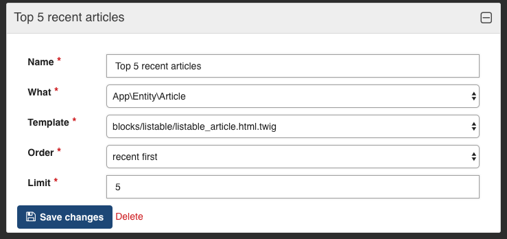

---
# Feel free to add content and custom Front Matter to this file.
# To modify the layout, see https://jekyllrb.com/docs/themes/#overriding-theme-defaults

layout: doc
title: OperaListBlockBundle
body_class: body-pink
---

The bundle [OperaListBlockBundle](https://github.com/opera-project/OperaListBlockBundle){:target="_blank"} provide a easy way to manage list of entities for opera-project cms:
- a new type of Block `ContentList` that gives the possibility of having block of listed entities.
- an interface `BlockListableInterface` to implements on your listable entities

## Installation

````
composer require opera-project/list-block-bundle
````

## Configuration Features

Presently, the `ContentList` Block configuration can configure thoses parameters

- `what` : which listable entity the block will use
- `template` : which twig template to use
- `order` : which order to display the listable entities
- `limit` : how many entities to display
- `tags` : filter by taxonomy (See [OperaTaxonomyBundle](OperaTaxonomyBundle))

## How to make an entity listable

### Tag entities

Add to your configuration file theses lines. It will tag your futures entities that implements `BlockListableInterface` as listable.

```yaml
# config.yaml
services:
    _instanceof:
        Opera\ListBlockBundle\BlockType\BlockListableInterface:
            tags: ['cms.block_listable']
```

### Implements BlockListableInterface

To make your entity listable and usable by the `ContentList` Block you must implements `BlockListableInterface`.
`BlockListableInterface` has two method to implements `listableConfiguration()` and `filterForListableBlock()`

```php

namespace App\Repository;

class MyNewListableRepository implements BlockListableInterface
{
    public function listableConfiguration(): array 
    {
        // todo implements
    }

    public function filterForListableBlock(Block $block): array
    { 
        // todo implements
    }
}

```

#### The listableConfiguration method

`listableConfiguration()` must returns an array that will be used in the admin to configure the available **templates** and available **orders** that can be used on your specific entity.

```php
public function listableConfiguration() : array 
{
    return [
        /**
         * The possible templates (name => path) for the entity
         */
        'templates' => [
            'name template 1' => 'blocks/listable/listable_article.html.twig',
            'name alternate template' => 'blocks/listable/listable_article_alternate.html.twig',
        ],
        /**
         * The possible order configuration for the entity
         */
        'available_orders' => [
            'recent first',
            'alphabetical',
        ]
    ];
}
```

#### The filterForListableBlock method

`filterForListableBlock()` must returns an array of the listable entity filtered by the chosen configuration in the admin.

```php
public function filterForListableBlock(Block $block) : array 
{
    /**
     * $blockConfig['order'] and $blockConfig['limit'] will have the order and limit
     * that have been configured in the admin block
     */
    $blockConfig = $block->getConfiguration();

    /**
     * You then have to filter your entities using the block configuration
     */
    $qb = $this->createQueryBuilder('a');

    if (isset($blockConfig['order'])) {
        switch ($blockConfig['order']) {
            case 'recent first':
                $qb->orderBy('a.createdAt', 'DESC');
                break;
            case 'alphabetical':
                $qb->orderBy('a.title', 'ASC');
                break;
            default:
                break;
        }
    }

    if (isset($blockConfig['tags'])) {
        $qb->innerJoin('a.tags', 't')
            ->andWhere('t.id IN (:tags)')
            ->setParameter('tags', $blockConfig['tags']);
    }

    if (isset($blockConfig['limit'])) {
        $qb->setMaxResults($blockConfig['limit']);
    }

    return $qb->getQuery()->getResult();
}
```

#### Create your templates

The array of entities filtered accordingly to the block configuration is stored in `contents` variable

```twig

    
        {{ item.title }}
        {{ item.text }}
    

```

### Configuration block

Your entity will now be available to select in the `ContentList` Configuration with it's availables templates and possibles orders.


