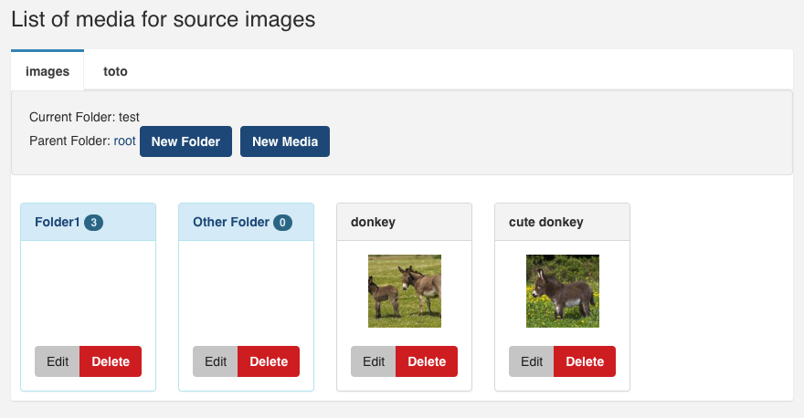

---
# Feel free to add content and custom Front Matter to this file.
# To modify the layout, see https://jekyllrb.com/docs/themes/#overriding-theme-defaults

layout: doc
title: OperaMediaBundle
body_class: body-pink
---

The bundle [OperaMediaBundle](https://github.com/opera-project/OperaMediaBundle){:target="_blank"} provides a way to manage media for opera-project cms:
- media manager
- upload of files
- media picker widget for form and also ckeditor

## Installation

````
composer require opera-project/media-bundle
````

## Configuration

### Configure require bundle Gaufrette and LiipImagine

The OperaMediaBundle use [KnpGaufretteBundle](https://github.com/KnpLabs/KnpGaufretteBundle){:target="_blank"} and [LiipImagineBundle](https://github.com/liip/LiipImagineBundle){:target="_blank"}.

You must configure your adapters and filesystems that will be used.

```yaml
# example in a config.yaml file
knp_gaufrette:
    stream_wrapper: ~
    adapters:
        images:
            local:
                directory: '%kernel.project_dir%/images'
                
    filesystems:
        images:
            adapter: images

liip_imagine:
    data_loader: opera_media.chain_loader
    filter_sets:
        opera_thumbnail:
            quality: 75
            filters:
                thumbnail: { size: [120, 120], mode: outbound }
```

### Configure OperaMediaBundle

Configure the list of sources your project will use and the filesystem that will be used

```yaml
# config.packages/opera_media.yaml
opera_media:
    sources:
        images:
            filesystem: gaufrette.images_filesystem
            wrapper: gaufrette://images/
```

## Media Manager

You will now have a media manager on the route `opera_admin_media_list` with the list of your configured sources (here, 'image' and 'toto') and their folders and media.



## Form Types, Image picker

There is two media form type used for the media picker:
- `Opera\MediaBundle\Form\MediaEntityType`
- `Opera\MediaBundle\Form\MediaTextType`

`MediaEntityType` is an EntityType of Media entity.
`MediaTextType` is the same but act as a TextType but use the path of the media.

Both use a custom widget design to show the MediaManager.

```php
use Opera\MediaBundle\Form\MediaEntityType;
use Opera\MediaBundle\Form\MediaTextType;

$builder->add('path', MediaTextType::class);
$builder->add('media', MediaEntityType::class);
```
## Media Picker

### Add Media Picker plugin to CKEDITOR

To add a button in your CKEditor to open a MediaPicker to insert a image you must add the `opera_media_picker` plugin in your plugins list and used config:

```yaml
fos_ck_editor:
    default_config: opera
    plugins:
        opera_media_picker:
            path:     "/bundles/operamedia/opera_media_picker/" # with trailing slash
            filename: "plugin.js"
    configs:
        opera:
            extraPlugins: "opera_media_picker"
```

### Add The Media Picker to an easy admin entity form

If you have a Article Entity that have a relation to the Media class from OperaAdminBundle, you can use `Opera\MediaBundle\Form\MediaEntityType` for the media type to have the media picker instead of a simple text select

```yaml
    entities:
        Article:
            class: App\Entity\Article # Add 'Article' class to easy admin entities
            form:
                fields: # customise the shown fields
                    # [...] all your other fields
                    - { property: image, type: Opera\MediaBundle\Form\MediaEntityType }
```

## Show your media in twig

### Show your images

```twig

    
        
    

```

inside `imagine_filter()` choose which resize of the image you want to use.  The list of available filter is configured under `filter_sets` parameters of `liip_imagine`.

### Display your videos/audios sound in twig

Create a route in your controller that gives the content of the media:

```php
use Symfony\Component\Routing\Annotation\Route;
use Symfony\Component\HttpFoundation\Response;
use Opera\MediaBundle\Entity\Media;

// in your controller

    /**
     * @Route("/my_media_route_exemple/{media}", options={"expose"=true}, name="my_media_route_exemple")
     */
    public function media(Media $media)
    {
        $response = new Response();
                
        if (!$media || !$sourceManager->hasSource($media->getSource()) {
            return $response->setStatusCode(Response::HTTP_BAD_REQUEST);
        }

        $source = $sourceManager->getSource($media->getSource());
        $content = $source->read($media);

        $response->headers->set('Content-Type', $media->getMime());
        $response->headers->set('Expires', '0');
        $response->headers->set('Cache-Control', "must-revalidate");
        $response->headers->set('Pragma', 'public');
        $response->headers->set('Content-Length', $source->size($media));

        $response->setContent($content);

        return $response->send();
    }
```

Use this route as video and audio source:

```twig

<!-- video -->
<video width="600" height="400" controls>
        <source src="/my_media_route_exemple/{{videoMediaId}}" type="video/mp4">
        <source src="/my_media_route_exemple/{{videoMediaId}}" type="video/ogg">
        <source src="/my_media_route_exemple/{{videoMediaId}}" type="video/webm">
    Your browser does not support the video tag.
</video>

<!-- sound -->
<audio controls>
    <source src="/my_media_route_exemple/{{soundMediaId}}" type="audio/ogg">
    <source src="/my_media_route_exemple/{{soundMediaId}}" type="audio/mpeg">
    <source src="/my_media_route_exemple/{{soundMediaId}}" type="audio/wav">
    Your browser does not support the audio tag.
</audio>

```