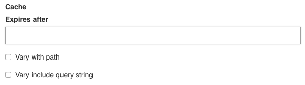

Opera have a cache manager. The blocks implementing `Opera\CoreBundle\BlockType\CacheableBlockInterface` will have added configurations to the admin.

## Admin config



- Expires after takes a string like `1 minute`, `2 days` or `1 month`
- Vary with path enabled: makes sure that a page with a slug `/post/{post_slug}` will not share the same cache if you go on page `/post/my-first-post` and `/post/my-other-post`
- Vary with query string enabled: makes sure that `/hello?query=exemple` and `/hello?query=other-exemple` don't have the same cache. On the contrary, disabled, they will share the same cache.

## How to make a block cachable

Imagine you have a block ExempleBlock already created. ([Doc: create your own block](/blocks))

### Implements CacheableBlockInterface

To make the block cachable, it must implements the Opera `CacheableBlockInterface`

```php

use Opera\CoreBundle\BlockType\BlockTypeInterface;
use Opera\CoreBundle\BlockType\BaseBlock;
use Opera\CoreBundle\Entity\Block;
use Opera\CoreBundle\BlockType\CacheableBlockInterface;
use Symfony\Component\OptionsResolver\OptionsResolver;

class ExempleBlock extends BaseBlock implements BlockTypeInterface, CacheableBlockInterface
{

    // [...]


    public function getCacheConfig(OptionsResolver $resolver, Block $block)
    {
        // By default empty.
        // So the block will be configured only by admin
        $resolver->setDefaults([]);
    }

}
```

### That's it.

You can also set default configuration for your block.

```php
public function getCacheConfig(OptionsResolver $resolver, Block $block)
{
    // Will still be on admin but with default values
    $resolver->setDefaults([
            'cache_key' => 'block_garage_'.$this->someVariable,
            'vary_query_string' => false,
            'expires_after' => '1 hour',
    ]);
}

```